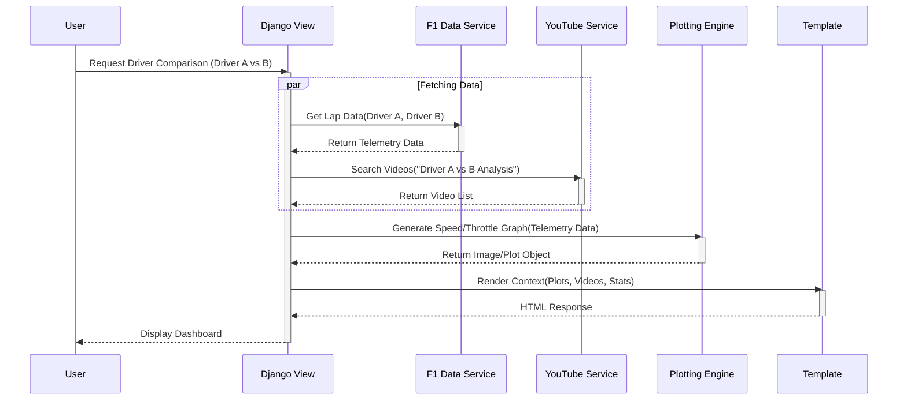

# Como Que 33: Formula 1 Integrative Dashboard


**Como Que 33** is a comprehensive web-based dashboard designed for Formula 1 enthusiasts. Going beyond simple race results, it aggregates real-time and historical data regarding drivers, circuits, and teams, enriching this data with multimedia content and advanced telemetry visualization.

The application serves as a centralized hub for standings, race calendars, and granular Grand Prix data, utilizing a robust Django backend to process telemetry for sector speed analysis and driver performance comparisons.

---

## Table of Contents

1. [Quick Start](#1-quick-start)
2. [Architecture & Diagrams](#2-architecture--diagrams)
    - [High-Level Architecture](#21-high-level-architecture)
    - [Core Tech Stack](#22-core-tech-stack)
    - [Project Structure](#23-project-structure)
    - [Data Flow & Sequence](#24-data-flow--sequence)
3. [Installation & Deployment](#3-installation--deployment)
    - [Prerequisites](#31-prerequisites)
    - [Docker Deployment (Recommended)](#32-docker-deployment-recommended)
    - [Manual Local Setup](#33-manual-local-setup)
    - [Production Deployment](#34-production-deployment)
    - [CI/CD Setup](#35-cicd-setup)
4. [Configuration](#4-configuration)
    - [Environment Variables](#41-environment-variables)
    - [Settings Overview](#42-settings-overview)
5. [API & File Documentation](#5-api--file-documentation)
    - [Core Configuration](#51-core-configuration)
    - [Application Logic (Como33)](#52-application-logic-como33)
    - [Frontend Assets](#53-frontend-assets)
6. [Dependencies & Repository Status](#6-dependencies--repository-status)
7. [Repository Statistics](#7-repository-statistics)
8. [Contributing](#8-contributing)
9. [License](#9-license)

---

## 1. Quick Start

The fastest way to get **Como Que 33** running is using Docker.

1.  **Clone the Repository**
    ```bash
    git clone https://github.com/braisgonzalezp/Integrative-Programming-Como33.git
    cd Integrative-Programming-Como33
    ```

2.  **Create Environment File**
    Create a `.env` file in the root directory:
    ```ini
    DEBUG=True
    SECRET_KEY=dev-secret-key
    DB_NAME=como33_db
    DB_USER=postgres
    DB_PASSWORD=postgres
    DB_HOST=db
    YOUTUBE_API_KEY=your_google_api_key_here
    ```

3.  **Run with Docker Compose**
    ```bash
    docker-compose up --build
    ```

4.  **Apply Migrations**
    In a new terminal window:
    ```bash
    docker-compose exec web python manage.py migrate
    ```

Access the application at `http://localhost:8000`.

---

## 2. Architecture & Diagrams

The project follows the standard **Django MTV (Model-Template-View)** architecture.

### 2.1 High-Level Architecture

The system interacts with users via a web interface, persists user data in PostgreSQL, and fetches racing data and multimedia from external APIs.

```mermaid
graph TD
    User[F1 Fan / User]
    
    subgraph "Como Que 33 System"
        WebApp[Django Web Application]
        DB[(PostgreSQL Database)]
    end
    
    subgraph "External Services"
        YT[YouTube Data API]
        F1[F1 Data Source\n(OpenF1 / FastF1)]
    end

    User -->|HTTPS Requests| WebApp
    WebApp -->|Read/Write Data| DB
    WebApp -->|Fetch Video Content| YT
    WebApp -->|Fetch Telemetry & Timing| F1
    
    style WebApp fill:#1f77b4,stroke:#fff,stroke-width:2px,color:#fff
    style DB fill:#2ca02c,stroke:#fff,stroke-width:2px,color:#fff
    style YT fill:#ff0000,stroke:#fff,stroke-width:2px,color:#fff
    style F1 fill:#ff7f0e,stroke:#fff,stroke-width:2px,color:#fff
```

### 2.2 Core Tech Stack

*   **Backend:** Python 3.9+, Django 4.2.1
*   **Database:** PostgreSQL (via `psycopg2`)
*   **Containerization:** Docker & Docker Compose
*   **Frontend:** Bootstrap 4, Django Crispy Forms
*   **Data Visualization:** Matplotlib (Backend generation)
*   **External APIs:** YouTube Data API v3, OpenF1/FastF1

### 2.3 Project Structure

The repository is structured with a deep directory hierarchy. The core logic resides within the `djangoProject` folder.

```text
📁 braisgonzalezp/Integrative-Programming-Como33
├── 📁 docuia_pa890m90/               # Documentation assets
│   ├── 📄 README.md                  # General Spanish documentation
│   └── 📄 proposal.pdf               # Project proposal
│
└── 📁 aplicacion_django.../          # Root Source Directory
    └── 📁 Proyecto/
        └── 📁 djangoProject/         # Main Django Project Root
            ├── 📄 manage.py          # Django CLI utility
            ├── 📄 Dockerfile         # Container definition
            ├── 📄 docker-compose.yml # Service orchestration
            │
            ├── 📁 djangoProject/     # Project Configuration
            │   ├── 📄 settings.py    # Global settings
            │   ├── 📄 urls.py        # Global URL routing
            │   └── 📄 wsgi.py        # WSGI Entry point
            │
            └── 📁 Como33/            # Main Application
                ├── 📄 apps.py        # App config
                ├── 📄 urls.py        # App routes
                ├── 📄 views.py       # Business logic (Calendar, Charts)
                ├── 📄 models.py      # Database models
                ├── 📄 forms.py       # Forms (Login/Register)
                └── 📄 admin.py       # Admin panel
```

### 2.4 Data Flow & Sequence

When a user requests a telemetry comparison (e.g., Driver A vs. Driver B), the system aggregates data from multiple sources before rendering the dashboard.



---

## 3. Installation & Deployment

### 3.1 Prerequisites
*   **OS:** Linux, macOS, or Windows (WSL2).
*   **Software:** Git, Docker Desktop, Python 3.9+.
*   **API Keys:** Google Cloud Console (YouTube Data API v3).

### 3.2 Docker Deployment (Recommended)
If `Dockerfile` and `docker-compose.yml` are missing from the repository root, create them using the content below.

**1. Create `Dockerfile`**
```dockerfile
FROM python:3.9-slim
WORKDIR /app
ENV PYTHONDONTWRITEBYTECODE 1
ENV PYTHONUNBUFFERED 1
RUN apt-get update && apt-get install -y gcc libpq-dev && rm -rf /var/lib/apt/lists/*
COPY requirements.txt /app/
RUN pip install --upgrade pip && pip install -r requirements.txt
COPY . /app/
RUN python manage.py collectstatic --noinput
CMD ["gunicorn", "como33.wsgi:application", "--bind", "0.0.0.0:8000"]
```

**2. Create `docker-compose.yml`**
```yaml
version: '3.8'
services:
  web:
    build: .
    command: gunicorn como33.wsgi:application --bind 0.0.0.0:8000
    volumes:
      - .:/app
    ports:
      - "8000:8000"
    env_file:
      - .env
    depends_on:
      - db
    environment:
      - DB_HOST=db
  db:
    image: postgres:13
    volumes:
      - postgres_data:/var/lib/postgresql/data/
    environment:
      - POSTGRES_DB=como33_db
      - POSTGRES_USER=postgres
      - POSTGRES_PASSWORD=postgres
volumes:
  postgres_data:
```

**3. Run**
```bash
docker-compose up --build
```

### 3.3 Manual Local Setup
Use this for development without Docker.

1.  **Virtual Environment:**
    ```bash
    python3 -m venv venv
    source venv/bin/activate  # Windows: .\venv\Scripts\activate
    ```
2.  **Install Dependencies:**
    ```bash
    pip install -r requirements.txt
    ```
3.  **Database:** Ensure local PostgreSQL is running and create a database named `como33_db`.
4.  **Run Server:**
    ```bash
    python manage.py migrate
    python manage.py runserver
    ```

### 3.4 Production Deployment
For production (e.g., Render, Railway, AWS):
1.  Set `DEBUG=False` in environment variables.
2.  Set `ALLOWED_HOSTS` to your domain name.
3.  Use a managed PostgreSQL instance.
4.  Configure a web server (Nginx) or PaaS to serve static files (or use WhiteNoise).

### 3.5 CI/CD Setup
A GitHub Actions workflow (`.github/workflows/django.yml`) is recommended to run tests on push:

```yaml
name: Django CI
on: [push]
jobs:
  build:
    runs-on: ubuntu-latest
    services:
      postgres:
        image: postgres:13
        env:
          POSTGRES_DB: test_db
          POSTGRES_USER: postgres
          POSTGRES_PASSWORD: password
    steps:
    - uses: actions/checkout@v3
    - uses: actions/setup-python@v3
      with: { python-version: "3.9" }
    - run: pip install -r requirements.txt
    - run: python manage.py test
      env:
        DB_HOST: localhost
        DB_NAME: test_db
        DB_USER: postgres
        DB_PASSWORD: password
```

---

## 4. Configuration

### 4.1 Environment Variables
The application requires the following variables in a `.env` file or environment configuration.

| Variable | Required | Description |
| :--- | :--- | :--- |
| `DEBUG` | Yes | `True` for dev, `False` for prod. |
| `SECRET_KEY` | Yes | Django security key. |
| `ALLOWED_HOSTS` | Yes | Comma-separated domains (e.g., `localhost,mysite.com`). |
| `DB_NAME` | Yes | PostgreSQL Database Name. |
| `DB_USER` | Yes | Database User. |
| `DB_PASSWORD` | Yes | Database Password. |
| `DB_HOST` | Yes | Database Host (`db` for Docker, `localhost` for manual). |
| `YOUTUBE_API_KEY`| Yes | Google Cloud API Key for YouTube Data. |

### 4.2 Settings Overview
Located in `djangoProject/settings.py`:
*   **`INSTALLED_APPS`**: Includes `Como33` and `crispy_forms`.
*   **`CRISPY_TEMPLATE_PACK`**: Set to `bootstrap4`.
*   **`DATABASES`**: Configured to use `psycopg2`.
*   **`STATIC_URL`**: URL prefix for static assets.

---

## 5. API & File Documentation

### 5.1 Core Configuration

*   **`manage.py`**: CLI entry point. Handles `runserver`, `migrate`, and `makemigrations`.
*   **`djangoProject/wsgi.py`**: Entry point for WSGI-compatible web servers (Gunicorn).
*   **`djangoProject/urls.py`**: Root URL router. Includes `Como33` URLs and Admin routes.

### 5.2 Application Logic (Como33)

*   **`Como33/views.py`**: Contains the business logic.
    *   `gpinfo2`: Fetches race results and images via external API.
    *   `comparation`: Handles driver telemetry comparison logic.
*   **`Como33/urls.py`**: App-specific routing.
    *   `/gpinfo/<year>/<circuit>/`: Grand Prix details.
    *   `/speed/<year>/`: Sector speed analysis.
    *   `/comparation/`: Driver comparison tools.
*   **`Como33/forms.py`**:
    *   `UserRegisteredForms`: Extends `UserCreationForm`. Adds explicit password confirmation fields and integrates with Crispy Forms.
*   **`Como33/models.py`**: Currently utilizes Django's built-in `User` models. Racing data is fetched ephemerally.

### 5.3 Frontend Assets

*   **`Como33/static/gulpfile.js`**: Gulp configuration for asset management.
    *   **Task `copy`**: Moves Bootstrap and jQuery from `node_modules` to `vendor/`.
    *   **Task `dev`**: Launches BrowserSync for live reloading during template development.

---

## 6. Dependencies & Repository Status

**Current Status:** The repository is primarily documentation-focused. To develop the software functionality described, the following dependencies must be installed via `pip`.

### Runtime Requirements
*   `Django>=4.2`
*   `psycopg2-binary` (PostgreSQL adapter)
*   `django-crispy-forms` & `crispy-bootstrap4`
*   `requests` (For API consumption)
*   `matplotlib` (For telemetry charting)
*   `gunicorn` (For production server)

### Development Requirements
*   `pytest` or `django-test`
*   `black` / `flake8` (Linting)

To initialize dependencies for development:
```bash
pip install django psycopg2-binary django-crispy-forms crispy-bootstrap4 requests matplotlib gunicorn
pip freeze > requirements.txt
```

---

## 7. Repository Statistics

To ensure the project remains maintainable and to track the scale of the codebase, we monitor the total number of files contained within the repository.

### Current File Count
To verify the number of archives (files) in your local copy of the **Como Que 33** repository, execute the following command in the root directory:

```bash
# Linux / macOS (Bash)
find . -type f -not -path '*/.*' | wc -l

# Windows (PowerShell)
(Get-ChildItem -Recurse -File).Count
```

> **Note:** This count includes all Python source files, templates, static assets, and configuration files. It excludes virtual environment directories if configured correctly in `.gitignore`.

---

## 8. Contributing

Contributions are welcome! Please follow these steps:
1.  Fork the repository.
2.  Create a feature branch (`git checkout -b feature/AmazingFeature`).
3.  Commit your changes (`git commit -m 'Add some AmazingFeature'`).
4.  Push to the branch (`git push origin feature/AmazingFeature`).
5.  Open a Pull Request.

---

## 9. License

This project is open-source and available under the MIT License.